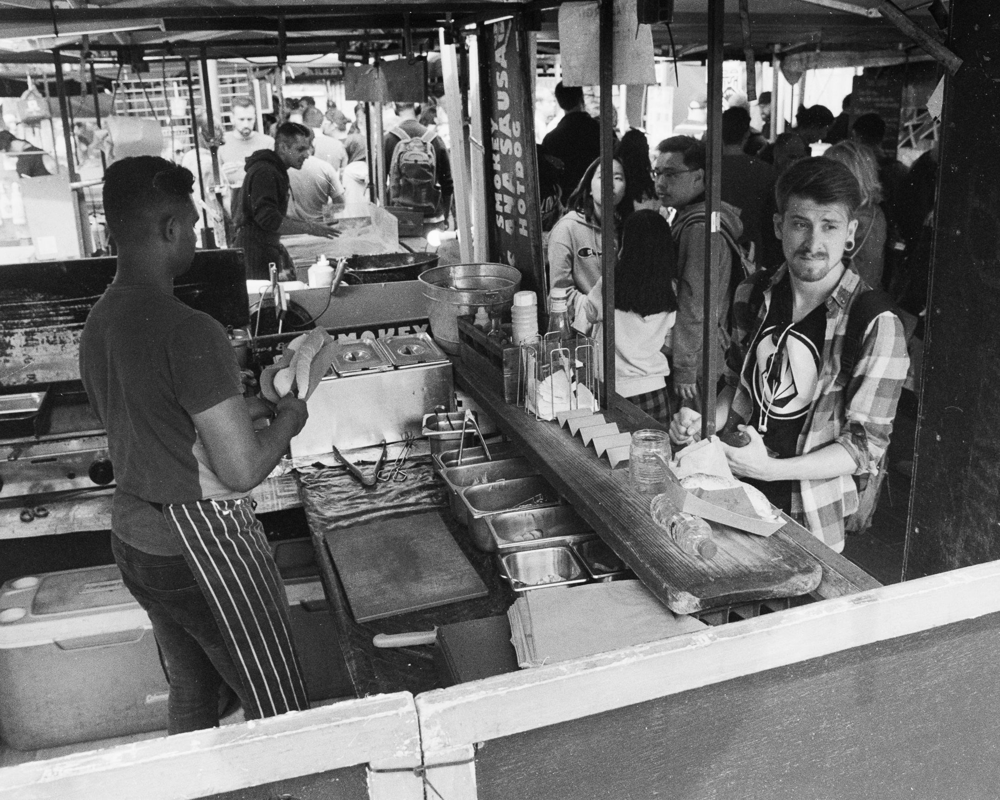
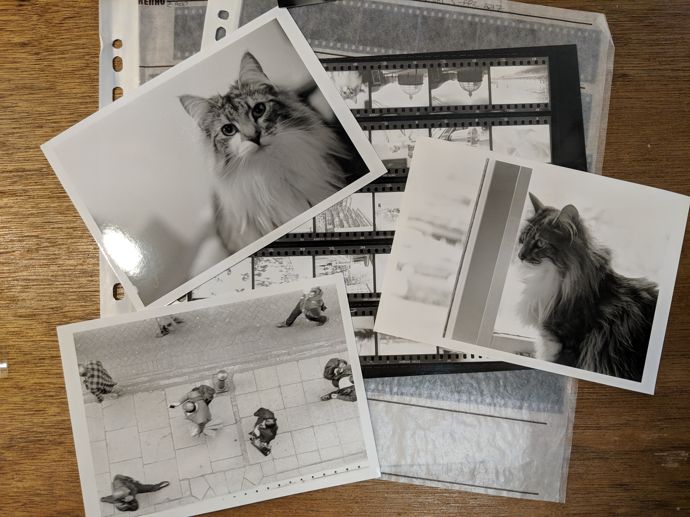

[I make photographs](https://naxxfish.photography) in my spare time. Although often they're [on film](https://naxxfish.net/2018/09/01/why-i-shoot-film-in-2018/), but as part of my hybrid workflow they almost always end up going through a digital process at some point. 

This post explains how I manage my photos from capture to archive, and how I manage backups. 
<!--more-->
**NOTE: This post is NOT sponsored by BackBlaze, even though I use them quite a lot...**

# 📸 Capture


I'll take the photo either using a digital camera, or a film camera.  For purely digital photos, I'll simply get the images off an SD card.  For film, I will develop the film first, scan it with my [Plustek Opticfilm 8100](https://plustek.com/uk/products/film-and-photo-scanners/opticfilm-8100/) (or whichever scanner is appropriate), in RAW/DNG format where possible. 

At the end of this process, there will be a folder somewhere with a bunch of RAW or DNG files in it ready to be ingested. 

# 🌮 Ingest


Once I've got some DNG/RAW files ready to ingest, I'll bring them into my [Adobe Lightroom](https://www.adobe.com/uk/products/photoshop-lightroom.html) catalogue.  My Lightroom catalogue is stored on my laptop hard drive, and sync'd to my [Nextcloud](https://nextcloud.com/) instance.  I've got a folder in my catalogue called `Photos Working` - this is where newly imported photos go.  It's on my laptop's internal SSD for speed and portability - which is encrypted and backed up with [BackBlaze](https://secure.backblaze.com/r/01mj5z) (*referal link alert!*).  This means I can edit newly photographed images almost immediately, and they're reasonably safe from loss (providing I have a decent Internet connection). 

I'll generally add any useful metadata at this stage, too.

I have a folder structure which looks something like this:

```
.
└── Photos\ Working
    ├── FILM\ year-month-day\ Shoot\ Subject (film type)
    └── year-month-day\ Shoot\ Subject
```

Generally speaking, each session I do only has one subject and/or purpose - so this tends to work quite well. 

# 🎞 Film post-capture processing
*(This section is only applicable to my film shooting activities)*


Generally speaking, I prefer to keep hold of the RAW files where possible and only apply non-destructive edits to them.  This can be somewhat problematic when scanning film. The scanning application I use, [Silverfast](https://www.silverfast.com/) (and, indeed, most scanning applications) allows you to make adjustments to the images as you scan thme, but they then end up being rendered into a JPEG, loosing all the RAW data that was there before.  

Silverfast has a feature which allows you to scan frames to [DNG format files](https://en.wikipedia.org/wiki/Digital_Negative) (which stands for Digital NeGative - although they were not particularly intended to be digital scans of actual negatives, rather an 'archival' grade format for digital photographs similar to physical analogue negatives). Lightroom can handle 'developing' these negative images with the built in tools - but getting the right colour cast for colour negatives correct is extremely tricky, and getting just the right inverted curves for black and white negatives is just as hard, and makes your brain hurt (because the curves control isn't meant to work that way around!)

Fortunately [Negative Lab Pro](https://www.negativelabpro.com/) exists, which is a plug-in for Lightroom that automates negative conversion in a non-descrutive manner, and generally does a fantastic job at getting the colour cast extactly as you want it. Also the new release features a decent Metadata extension for Film shooters, which is pretty awesome too :).  

# 🎛 Editing
Well, this is where the magic happens, and is going to be different for everyone.  In Lightroom, I'll generally crop, tweak levels and curves, perhaps clone out the odd weird distracting thing or speck of dust from a scan. 

I try to get as much right in-camera as possible, but even so I will need to go though the images at first and pick ones which I want to focus on, and reject the ones that I don't.  

If my shoot is mostly of the same scene, I'll tend to find a representative image and apply some basic Develop edits to it (Exposure, perhaps curves) and copy those develop settings to the rest of the images in that shoot to act as a starting point.  I find this helps me get a more consistent result if I need multiple images or angles from the same scene. 

# 🖼 Publishing/Exporting

Usually I'll want to export my pictures so that I can either publish them online myself, or give to a 'client' so they can do the same.  

In Lightroom, I have a bunch of useful Export Presets for various social media platforms, blogs, websites etc. For each 'client' I'll create a folder in a folder on my internal SSD called `Photos Export` which is sync'd with my [Nextcloud](https://nextcloud.com/) instance. In the client's subfolder I'll make a folder for each 'job'.  In each 'job' folder, I'll create a folder for each type of export they require - for example one folder for Instagram photos and another for blog photos.  The structure will look something like this:

```
.
└── Photos\ Export
    └── Client
        └── Job\ Name
            ├── Blog
            └── Instagram

```

This makes it easy to continuously share things with a 'client', as all of their images are in on folder.  I just give a client an account on my [Nextcloud](https://nextcloud.com/) instance. They could even sync with it if they like to get my photos instantly downloaded, or install the app on their phone to access the files immediately. 

# 🗃 Archive
Once I'm done with the immediate edits and/or exporting, and I'm back home, I'll use Lightroom to move the folder from my `Photos Working` folder on my internal SSD, to my `Photos Archive` directory on my external LaCie 2big Thunderbolt disk enclosure.  This folder is also sync'd with my [Nextcloud](https://nextcloud.com/) on my home server, so the files will be backed up onto my personal server when it becomes possible to do so. It's also backed up to [BackBlaze](https://secure.backblaze.com/r/01mj5z) for extra security.  My desk setup at home base looks something like this:
```
    
             ┌────────────┐         
             │  MacBook   │         
             └──────┬─────┘         
                    │               
                    │               
    ┌───────────────┴──────────────┐
    │ Belkin Thunderbolt 2 HD Dock │
    └────┬────────────────────┬────┘
         │                    │     
         │                    │     
    ┌────┴───┐            ┌───▼───┐ 
    │ 1Gbps  │            │  .─.  │ 
    │ Switch │            │ (   ) │ 
    └────┬───┘            │  `─'  │ 
         │                │       │ 
    ┌────┴───┐            │ LaCie │ 
    │┌──────┐│            │ Drive │ 
    │├──────┤│            └───────┘ 
    │├──────┤│                      
    │└──────┘│                      
    │        │                      
    │  Home  │                      
    │ Server │                      
    └────────┘                      

```

*(Yes, I know, Thunderbolt 2 is so old hat. Whatever, I'm not getting a new MacBook for a little while yet.)*

# 📼 Backups

Whilst I'm away from base, my `Photos Working` folder will be backed up using [BackBlaze](https://secure.backblaze.com/r/01mj5z) by virtue of the fact it's on my internal SSD. I also have a small portable hard drive if I'm away from a decent internet connection for some time, or am away from base for an extended period. 

But once I'm back at base and my photos are in the `Photos Archive` folder, I can now implement my [3-2-1 backup strategy](https://www.backblaze.com/blog/the-3-2-1-backup-strategy/) - **three** copies of the data, **two** onsite and **one** offsite. 

 * The **first** copy sits on my LaCie drive connected to my dock, which is fast and available when I'm sitting at my desk.  Excellent for making quick edits to old shoots.  

 *  The **second** copy sits on my Home server, which is synchronised with the LaCie drive. And this in turn is backed up to...

 * The **third** copy, which is an encrypted backup sitting in a [Backblaze B2 bucket](https://www.backblaze.com/b2/cloud-storage.html) (which is very cost effective) which is periodically backed up by [duplicity](http://duplicity.nongnu.org/) (which is free software).

# Conclusion
I find this way of working works for me, and fits my needs and budget well.  I've seen other variations which go from buying a new portable hard drive every year (argh!) or working exclusively in the cloud.  For me, my workflow strikes a nice balance between making use of cloud technology whilst keeping ownership of my own data, as well as keeping it safe.  

