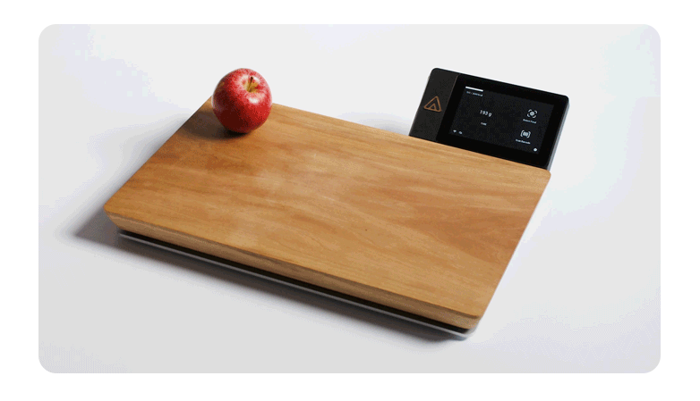

Many moons ago, I was a host on a podcast called The Gadget Crowd.

My role was to do the deep dives into the technical feasibility of the projects that we talked about - usually tempering the hyperbolic claims of the campaigns into something more realistic.  I also featured a number of exceptionally bizarre campaigns claiming everything from a perpetual motion machine powered by demonic forces (legitimately what the project claimed), to a device that was designed to release your inner *chi* by regularly beeping (who's campaign text read much like the incoherent ramblings of someone with severe psychosis). 

Over the years, many crowdfunded tech projects have come and gone, and the public has now experienced a range of outcomes from great success (for example the [RiutBag](https://www.riut.co.uk/), which delivered exactly as intended and is a ongoing business delivering new, useful, products regularly), to great failures (like [Juicero](https://www.theguardian.com/technology/2017/sep/01/juicero-silicon-valley-shutting-down) - which was a legitimate, but dumb, idea that just failed), to outright scams (like [ZNAPS](https://www.kickstarter.com/projects/1041610927/znaps-the-9-magnetic-adapter-for-your-mobile-devic/description) - where backers have now resorted to magic incantations trying to get their money back). The general public has seen it all.

Fast forward a few (*cough* five) years, and there's [/r/shittykickstarters](https://www.reddit.com/r/shittykickstarters/)

Now, let me say, most of the posts on this subreddit are legitimately bad campaigns - which are either unfeasible, physically impossible or in some other way questionable (e.g. rebrands of products available from contract manufacturers).  But sometimes, those redditors are a bit too ready to take up their pitchfork

Take this one, [Aurora Nutrio](https://www.indiegogo.com/projects/aurora-nutrio-the-easiest-way-to-track-food/x/19988273#/)

<!--more-->

<iframe width="560" height="315" src="https://www.youtube-nocookie.com/embed/qipnGL5vHzA" title="YouTube video player" frameborder="0" allow="accelerometer; autoplay; clipboard-write; encrypted-media; gyroscope; picture-in-picture" allowfullscreen></iframe>

Now - I'll say from the start - I have no idea if this campaign is intending on delivering the product. They *could* be scammers who will just disappear with the money once the campaign ends. I have no association with them, I have no way to know anything of their integrity. Likewise, their product *could* still fail to launch - I don't know how these entrepaneours are going to scale to production, which is a challenging phase even for experienced product designers and engineers. And even then, the product *could* still fail to perform as well as they promise. 

However, they've been brought up on [their own thread in shittykickstarters](https://www.reddit.com/r/shittykickstarters/comments/msxj2f/aurora_nutrio_a_smart_cutting_board_that_scans/), who's OP says:

> The claim is that this cutting board has a scanner that can scan any type of food that you put on it and it knows what it is. If you can make a scanner like that you wouldn't need a crowdfunding project.

Now, if you look at their [Indiegogo Campaign Page](https://www.indiegogo.com/projects/aurora-nutrio-the-easiest-way-to-track-food/x/19988273#/), they say:

> Nutrio recognizes all fresh as well as packaged foods. 

I would say that the claim that it recognises **all** fresh foods is probably a bit of an optimistic stretch. However, being able to *recognize* (note the word *recognize*, not *analyze*) a variety of foods - is completely plausible. 

Let me take you on a little tangent for a moment...

# SCiO "scam"

Reading the thread, the OP and others make the connection between this project, and the [ill-fated SCiO "food scanner"](https://spectrum.ieee.org/the-human-os/biomedical/devices/angry-kickstarter-backers-ask-scio-wheres-my-pocketsized-molecular-sensor).  That project claimed to have a handheld device that was capable of performing advanced food analysis, telling you the nutrient content of a piece of food. 

So, why have they not shipped their original device to all of their backers (they did managed to ship 5,000 out of 13,000), even years after it being successfully funded? Because they realised that it [wasn't as good as they had hoped](https://nocamels.com/2019/03/scio-kickstarter-darling-promises-molecular-sensor/). 

[At least one backer shot an unboxing video](https://www.youtube.com/watch?v=k6eGCiKqm4k). He manages to scan a potato, and gets back a spectrograph for it, which - doensn't tell you very much on it's own. [Near Infra Red Spectroscopy](https://en.wikipedia.org/wiki/Near-infrared_spectroscopy) is very much a real thing, and is already used in many applications - but most average consumers have no idea what a spectrograph of their food actually means.

Knowing the molecular content of a piece of food, without any additional information or context - is not very useful for consumers. It doesn't directly tell you how many calories a piece of food may contain. Determining the nutrional values of food relies on [*a priori*](https://en.wikipedia.org/wiki/A_priori_and_a_posteriori) information about that particular food, to know what a particular molecular makeup means in context of a non-homegenous substance. A peak in a certain protien in an apple might indicate something quite different in terms of nutrition to the same protien in a piece of chicken - for the entire piece of food. An over-simplified analogy might be: measuring a round object covered in aluminium foil and saying "aha, it's got a high content of aluminium. I've seen things that have a high content of aluminium, they're all easter eggs! So, it must therefore have 6,000 calories" - but in reality it's actually a piece of cabbage wrapped in foil. 

That isn't to say that a spectrometer in a small form factor isn't a potentially useful piece of technology - the problem is, it was marketed as some kind of magic trichorder that can determine the nutrient content of any random food that you point it at - and it couldn't possibly live up to that. Add to that, mass producing said devices is not straightforward either - especially with such a small form factor. In the IEEE article about this, the CEO admits as such:

>  “I don’t want to say it’s normal delays, because it’s not a normal product.” The company had to make a new optical sensor that could be mass-produced, and then integrate it into a consumer gadget. “This is not standard manufacturing,” he says. “You can’t just go to China and get a mold.”

Whilst this *could* be completely made up - it's at the very least plausible. Technology made from widely used components - like the kind in most standard consumer electronic devices - is not difficult to have manufacturered. There are many contract manufacturing services in China that allow you to send a fully integrated order for circuit boards (for which they can locally source common components - and even flash firmware onto the boards on your behalf), and an enclosure (of your own design or from a catalogue), which they will fully assemble and ship to you. But, those services usually are limited to using common components and materials. If you have some exotic part in your design (like, I don't know, the sensor and optics for a miniautre near infrared spectrometer), you usually have to have those manufactured by a specialist. And if that's something extremely precise with high tolerances, then the process of setting up the tooling to mass produce that component can be quite time consuming - going through a cycle of tooling, test runs, validation, QA testing, then going back to tooling again to make tweaks. 

Since that campaign, the company has moved on to other products like the [Dry Matter Analysis cup](https://www.consumerphysics.com/dairy-animal-nutrition/), intended for dairy farmers to measure moisture content in silage (their animal feed stock). This is an application that makes a lot more sense - farmers already analyse their silage, specifically for water content - often by sending it to a lab, although the process can be undertaken [using only basic kitchen equipment](https://projectblue.blob.core.windows.net/media/Default/Imported%20Publication%20Docs/Calculating%20dry%20matter%20of%20samples%20in%20dairy%20cows.pdf). And this new product from SCiO uses near infra-red spectroscopy to analyse the water content of silage - which is a novel idea, and one that [backed by research](https://www.researchgate.net/publication/338073061_Determination_of_water_content_in_corn_stover_silage_using_near-infrared_spectroscopy) - and has distinct advantages in terms of turnaround time for your analysis. 

Moisture content in silage is one of the most important ones to dairy farmers to get the [nutrition for their livestock correct](https://afs.ca.uky.edu/content/watch-moisture-content-silages-feedout). Speeding up this (well known) process has uncontraversial utility, making the technology they've developed useful. It also neatly sidesteps the issue their first product encountered: you can be (reasonably) sure that the material being analysed is going to be one of a short list of possible silage types - [their demo video of the app shows the silage type selection screen](https://youtu.be/XrdL20ruRnA?t=74). 

Clearly, the "Consumer Physics" company has found it's niche - and ironically enough - it's not consumers.

Should they have refunded their backers of the SCiO who didn't get their reward? [Yes](https://www.kickstarter.com/blog/accountability-on-kickstarter). 

Are there any backers who have not had their device, and also not been refunded? In fact, yes, Consumer Electronics informs me that they have delivered 12,000 of their devices to backers and offered anyone who didn't recieve their device a refund. If there are backers out there that haven't recieved their reward or a refund, that would point to malpractice in their administration more than anything - but that does not seem to be the case. 

Does the device do what backers expected it to do? No, probably not. If the marketing suggested it was a magic trichorder able to accurately measure the nutrion content of anything you scanned with it - that was overly optimistic at best, and actively misleading at worst. 

But what they aren't are snake-oil salesmen trying to sell you devices based on magical woo that's physically impossible. 

# What's this got to do with a cutting board?

Glad you asked. 

The link between these two projects is the claim, as the OP suggests:

> The claim is that this cutting board has a scanner that can scan any type of food that you put on it and it knows what it is. 

So, does this cutting board contain a near-infra red spectrometer that will suffer from the same problem as the SCiO? 

Nope. At least, not any more. It uses a pretty different technique.  Take a look at this screen grab from their video:

The transparent section circled in red is a where camera module sits inside the touchscreen enclosure (this is confirmed by [their statement on Reddit](https://www.reddit.com/r/shittykickstarters/comments/msxj2f/aurora_nutrio_a_smart_cutting_board_that_scans/gv2dxv5?utm_source=share&utm_medium=web2x&context=3)) - it points towards a specific point on the board (that weird metal circle), where you place the food to be identified.

You go through the UI in the touchscreen, ask it to "Detect food", and it takes a photo and either processes it internally, or sends to a cloud service, to be run through an image classifier. 

Once you've got a classification for your image, you link those labels to a nutritional database (containing more information about the food) which you've built (or sourced), and use the load cell underneath the board to determine weight and multiply the calories/nutrients per gram to get your numbers for your tracking app. Then you just send both numbers to your app via Bluetooth or Wifi, and let the app do the rest of the calculation. Or do it in the device - if you prefer - multiplying numbers together is hardly a difficult operation. 

Some commenters have jumped to the conclusion that we metal circle thing, instead of being a marker (actually, it's also a NFC reader) is in fact the "food sensor", which is somehow "looking up at the food". *UPDATE*: turns out, they're partially correct! It is a NIR spectrometer - however, the final product doesn't use this technology as they state in [their statement on Reddit](https://www.reddit.com/r/shittykickstarters/comments/msxj2f/aurora_nutrio_a_smart_cutting_board_that_scans/gv2dxv5?utm_source=share&utm_medium=web2x&context=3) that "there needs to be more research and development."

This is a big logical jump - the creators don't say anywhere that's how it works. If they did, they are right to be sceptical. Actually, the only person who said that was how it worked was [/u/kickstarterscience](https://www.reddit.com/user/kickstarterscience/), who says:

> The claim is that this cutting board has a scanner that can **scan** any type of food that you **put on it** and it knows what it is

That's not what they claim. But, they've built a straw-man and are now proceeding to stab it. Another redditor goes on to say:

> but last time i put anything on top of a camera the image was black...

Yes. That would be a very bad place to put a camera. That why you put it in the touchscreen where it can see the item of food on the board 🤷. 

# What, you're saying it'll be a success?

No. The main challenge of this product is less the hardware design (which is not trivial, it's also not hugely complex, there are much more physically complex kitchen appliances already on the market), and more the software design. 

Recognising food from images is difficult. It was lampooned in this episode of Silicon Valley, in the [Hotdog/Not Hotdog](https://youtu.be/pqTntG1RXSY) algorithm:

<iframe width="560" height="315" src="https://www.youtube-nocookie.com/embed/pqTntG1RXSY" title="YouTube video player" frameborder="0" allow="accelerometer; autoplay; clipboard-write; encrypted-media; gyroscope; picture-in-picture" allowfullscreen></iframe>

However, there's been serious research and progress on the topic since the show aired, for example in this paper published by Singapore Management University, [Food Image Recognition by Deep Learning](https://images.nvidia.com/content/APAC/events/ai-conference/resource/ai-for-research/FoodAI-Food-Image-Recognition-with-Deep-Learning.pdf). There's another paper from 2020 called [Machine Learning Based Approach on Food Recognition and Nutrition Estimation](https://www.sciencedirect.com/science/article/pii/S1877050920316331) There are even commcerially available apps that do it like [Calorie Mama](https://apps.apple.com/app/apple-store/id1121789860) - it's even got an [Food Regonition API](https://dev.caloriemama.ai/). 

Providing they've got a really extensive dataset of food, of many different types, all shot at a similar angle to the angle the cutting board camera sees them at, and you have the technical expertise to build a model that performs well, they have every chance of success at making a useful product - or at least a product as useful as a phone tracking app.

But, they could still encounter all kinds of problems along the way, and might not ship a product that meets the expectation of backers.  But, it's not going to have been because it was physically impossible, or excessively implausible. 

# So, why are you writing about this?

Well, because [I explained this logic in the /r/shittykickstarters thread](https://www.reddit.com/r/shittykickstarters/comments/msxj2f/aurora_nutrio_a_smart_cutting_board_that_scans/guw3jyg?utm_source=share&utm_medium=web2x&context=3), and the comment is being downvoted consistently, because I had the audacity to not join the witch hunt and give the campaign the benefit of the doubt, who have not - so far - shown that they are in any way fraudulent. 

Whilst I'm not planning on backing the project (it's not really a product I'm interested in, or could justify the expense of), it seems rather unfair to smear the campaign with claims of fraud or pseudo-science based on a method of operating that was entirely made up by someone who didn't like the campaign.  It started to remind me of [this scene](https://youtu.be/zrzMhU_4m-g?t=23) from "[Monty Python and the Holy Grail](https://www.imdb.com/title/tt0071853/)"

<iframe width="560" height="315" src="https://www.youtube-nocookie.com/embed/zrzMhU_4m-g?start=20" title="YouTube video player" frameborder="0" allowfullscreen></iframe>

---

**MOB**: We have found a witch may we burn her?? (*BURN HER!!!*)

**KNIGHT**: How do you know she is a witch?

**MOB**: She looks like one!! (*YEAHhhh*)

**KNIGHT**: Bring her forward ...

**WOMAN**: I'm not a witch, I'm not a witch!

**KNIGHT**: But, you are dressed as one?

**WOMAN**: *they* (the mob) dressed me up like this. And this isn't my nose it's a false one!

**KNIGHT**: (Inspects false nose) ... well?

**MOB**: Well, we did do the nose.

**KNIGHT**: And...?

**MOB**: ... and the hat. But she's a witch!!!

**KNIGHT**: Did you dress her up like this?

**MOB**: No, no no, no. Yes. A bit. Yes, a bit. She has got a wart! 

... and so on ... 

---

I can only imagine the /r/shittykickstarter mob being around when the first MP3 players started to come onto the market...

"You claim you're going to get 60,000 CD worth of music into that tiny little thing by grinding them up into a fine paste, then injecting them into a small tank behind the screen, and then having a tiny gremlin reconstruct them song by song when you want to play them? That's BULLSHIT! You're a FRAUD!" says the mob. 

"Wait, no I didn't say any of ...." protests the designer. 

"You're trying to TAKE my HARD EARNED MONEY"

"No, but you're giving me..."

"This should be ILLEGAL!!!"

"Oh, just, fine, whatever 🤷" says the designer, walking off, leaving the MP3 player undeveloped, and the world a different place forever. 

---

In conclusion: I think it's right to be skeptical of any crowdfunded project, especially those aimed at consumers who may not give it as much scrutiny as other investors might. But it stops being acceptable when you declare a project to be fraudulent or unscientific, when your only basis for this an assumption you've made about the project's implementation. 

**UPDTE**: (*22/04/2021*) I recieved a reply back from Consumer Electronics (creators of SCiO) who have confirmed that they shipped 12,000 SCiO devices to their backers and refunded any who did not recieve their device.  

Also, [Aurora have since had a statement from Nutrio about the board](https://www.reddit.com/r/shittykickstarters/comments/msxj2f/aurora_nutrio_a_smart_cutting_board_that_scans/gv2dxv5?utm_source=share&utm_medium=web2x&context=3) - I was mostly right, but the sensor shown *was* a NIR Spectrometer, but that no longer features in the product as they found that the technology wasn't mature enough for the consumer market. 
